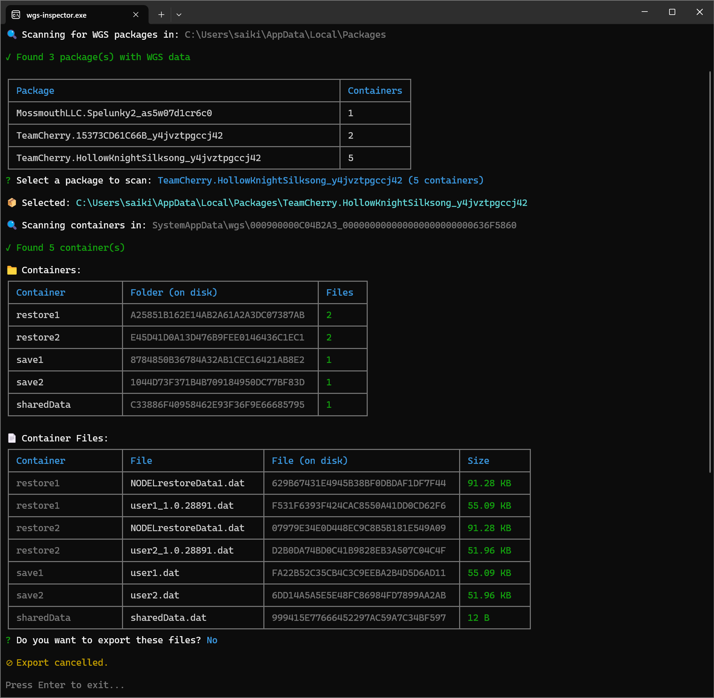

# WGS Inspector

[Download](../../releases) • [Documentation](./docs) • [Report Bugs](../../issues)

Inspect your **Game Pass** (Windows Gaming Services) save files, and optionally export them to a readable format.



Game Pass stores save files in obfuscated WGS containers with cryptic directory names (GUIDs), making them difficult to access. This tool inspects these containers and optionally exports the save files to a readable format, as they would appear on saner 😄 platforms like Steam.

I originally wrote this for exporting _Hollow Knight: Silksong_ saves from Game Pass. The  Silkeater icon used for the executable is from Silksong, a consumable item that retrieves Hornet's Cocoon, regardless of where it is in the world.

## 🚀 Quick Setup

You can either use the pre-built standalone executable or run the project from source.

### Use the standalone executable (Recommended)

1. Download and extract the `wgs-inspector` zip file from the [latest release](../../releases)

2. Run `wgs-inspector.exe`

3. Select the appropriate package name for your game from the interactive menu

4. Choose export method:

    - **Game-specific exporter** (if available) - Exports files in a structured format as defined by the exporter
    - **Generic exporter** - Exports files as they are found in the containers

5. Find your saves in a timestamped subfolder inside `exported_wgs_save_files/` (or your chosen directory), created next to the executable (or project root if running from source)

### Run from source

1. **Install Node.js (v20.6.0 or higher)**: Download from [nodejs.org](https://nodejs.org)

2. **Clone and install dependencies**:

    ```bash
    git clone --depth 1 https://github.com/saiki-k/wgs-inspector.git
    cd wgs-inspector
    npm install
    ```

3. **Run the exporter**:

    ```bash
    node src/index.js
    ```

## 📁 Export Formats

### With a game-specific exporter

When a game-specific exporter is available, saves are exported in a structured format as defined by the exporter. For instance, the Hollow Knight / Hollow Knight: Silksong exporter exports files like so:

```
exported_wgs_save_files/
└── 2025.11.16-14.30.45__TeamCherry.HollowKnightSilksong_y4jvztpgccj42/
    ├── user1.dat                    # Save slot 1
    ├── user2.dat                    # Save slot 2
    ├── shared.dat                   # Shared game data (encrypted for Steam)
    ├── Restore_Points1/             # Restore points for slot 1
    │   ├── NODELrestoreData1.dat
    │   ├── restoreData2.dat
    │   └── ...
    ├── Restore_Points2/             # Restore points for slot 2
    │    ├── NODELrestoreData2.dat
    │    └── ...
    └── ...
```

### With the generic exporter

For games without a specific exporter, or when using the generic exporter, files are exported as they are found in the containers. For instance, a generic export for Hollow Knight save files looks like this:

```
exported_wgs_save_files/
└── 2025.11.16-14.30.45__TeamCherry.15373CD61C66B_y4jvztpgccj42__generic-export/
    ├── save1/          # Container name
    │   └── user.dat    # File name
    ├── Preferences/    # Container name
    │   └── Data        # File name
    └── ...

```

## 🛠️ Building from Source

Run the following command to create a standalone executable:

```bash
npm run build
```

The executable and zip package will be created in the `build/` directory. Requires Node.js v20.6.0 or higher.

## 🔧 Project Structure

```
src/
├── index.js                     # Entry point
├── cli/                         # Interactive CLI
│   ├── index.js
│   └── helpers.js
├── scanner/                     # WGS parsers
│   ├── index.js
│   ├── containerIndexScanner.js # Parses containers.index
│   └── containerScanner.js      # Parses container.* files
├── exporters/                   # Export implementations
│   ├── index.js                 # Exporter registry (PACKAGE_EXPORTER_MAP)
│   ├── generic/                 # Generic exporter
│   │   └── index.js
│   └── hollowKnight/            # Hollow Knight / Hollow Knight: Silksong exporter
│       ├── index.js
│       └── codec.js
├── docs/                        # Technical documentation
│   ├── SCANNERS.md              # Scanner module overview
│   └── exporters/
│       ├── README.md            # Exporter system overview
│       └── HOLLOW_KNIGHT.md     # Hollow Knight/Silksong exporter overview
└── build/
    └── index.js                 # Build script
```

## 📚 Documentation

See [docs/](./docs) for detailed technical documentation on scanners, exporters, and (any) game-specific exporter implementations.

-   [Scanner Module](./docs/SCANNERS.md) - WGS container parsing details
-   [Exporters Module](./docs/exporters/README.md) - Exporter system overview
-   [Hollow Knight Exporter](./docs/exporters/HOLLOW_KNIGHT.md) - Hollow Knight/Silksong exporter overview

## 🤝 Contributing

Contributions welcome! Feel free to open an issue or submit a pull request.

### Adding new game-specific exporters

To add an exporter for a new game:

1. Create a new exporter in `src/exporters/your-game/`
2. Export an object with `{ name, color, exporter }`
3. Register it in `src/exporters/index.js` in the `PACKAGE_EXPORTER_MAP`

See `src/exporters/hollowKnight/` for a reference implementation or read the [Exporters documentation](./docs/exporters/README.md).

## 📄 License

MIT © [saiki-k](https://github.com/saiki-k)
